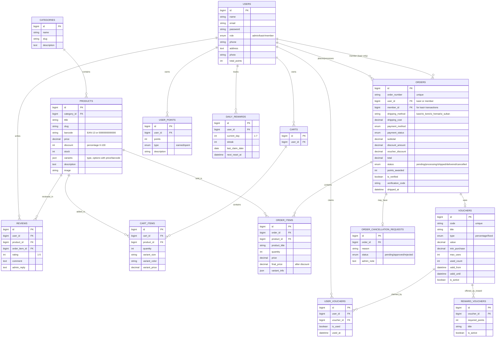

# Database ERD - Aplikasi Kasir POS & E-Commerce

## Diagram Hubungan Antar Tabel (Simplified)

---

## Penjelasan Singkat untuk Presentasi

### **1. USER MANAGEMENT**
- `users` → Pusat sistem (admin/kasir/member)
- Simpan data: nama, email, role, poin, foto

### **2. PRODUCT CATALOG**
- `categories` → Kelompok produk (Makanan, Minuman, dll)
- `products` → Detail produk (harga, diskon, stok, varian)
- Varian disimpan dalam format JSON (ukuran, warna, harga berbeda)

### **3. SHOPPING CART (Online)**
- `carts` → Keranjang per user
- `cart_items` → Item dalam keranjang (produk + jumlah + varian)

### **4. ORDERS & TRANSACTIONS**
- `orders` → Transaksi (kasir atau online)
  - **Kasir**: `user_id` = kasir, `member_id` = customer, `shipping_method` = kasir
  - **Online**: `user_id` = member, `shipping_method` = si_kere/si_hemat/si_sultan
- `order_items` → Detail produk yang dibeli
- `order_cancellation_requests` → Pengajuan pembatalan oleh customer

### **5. REWARDS & GAMIFICATION**
- `vouchers` → Kupon diskon (% atau nominal)
- `user_vouchers` → Voucher yang dimiliki member
- `reward_vouchers` → Voucher yang bisa ditukar dengan poin
- `daily_rewards` → Hadiah harian (streak 7 hari)
- `user_points` → Riwayat poin (dapat/pakai)

### **6. REVIEWS**
- `reviews` → Rating & komentar produk dari customer
- Admin bisa reply review

---

## Flow Bisnis Utama

### **A. TRANSAKSI KASIR (Offline POS)**
1. Kasir scan barcode → Tambah ke cart kasir
2. Customer bayar → Buat `orders` (status: paid & delivered)
3. Jika customer member → Catat di `member_id`, kasih poin
4. Update stok produk

### **B. TRANSAKSI ONLINE (E-Commerce)**
1. Member pilih produk → Tambah ke `cart_items`
2. Checkout → Pilih voucher, ongkir → Buat `orders`
3. Status flow: pending → processing → shipped → delivered
4. Setelah delivered → Member dapat poin & bisa review

### **C. REWARDS SYSTEM**
1. Member belanja → Dapat poin (5% dari total belanja)
2. Daily login → Klaim hadiah harian (poin/voucher)
3. Tukar poin → Redeem voucher di `reward_vouchers`
4. Pakai voucher → Diskon saat checkout

---

## Tips untuk Draw.io

1. **Copy** diagram Mermaid di atas
2. Buka https://mermaid.live
3. **Paste** kode Mermaid → Lihat preview
4. **Export** as PNG/SVG
5. **Import** ke Draw.io atau langsung pakai screenshot

Atau langsung paste ke Draw.io yang support Mermaid syntax!

---

## Tabel Penting vs Skip

### ✅ **PENTING (Tampilkan)**
- users, categories, products
- carts, cart_items
- orders, order_items
- vouchers, user_vouchers
- reviews, user_points

### ⏭️ **SKIP (Ga Perlu Presentasi)**
- cache, cache_locks
- failed_jobs, jobs, job_batches
- migrations, password_reset_tokens
- sessions
- banners, notifications, point_transactions

---

**Semoga membantu presentasi lo! 🚀**
